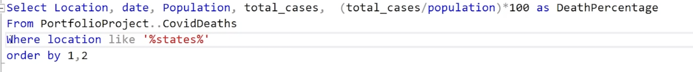
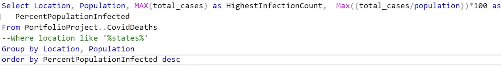

 # AliSyedPortfolio

# [Project 1: Regional departmental sales store recommendations](https://github.com/HassenAliSyed/AliSyedPortfolio)

## Overview of the SQL queries I used in the project
### Skills used:  Data cleaning, ETL, Converting currency, Joins, Count fucntion,  SUM function , And & Or Clauses, Alias.

#### Show all customer records

Show total number of customers
 

Show transactions for Chennai market (market code for chennai is Mark001

Show distinct product codes that were sold in chennai

Show transactions where currency is US dollars

-
Show transactions in 2020 join by date table

Show total revenue in year 2020,

Show total revenue in year 2020 in Chennai

##### Tableau Dashboard

# [Project 2: Covid deaths by country](https://github.com/HassenAliSyed/AliSyedPortfolio)

Covid 19 Data Exploration 
Skills used: Joins, CTE's, Temp Tables, Windows Functions, Aggregate Functions, Creating Views, Converting Data Types

#### Data Visualization

.
